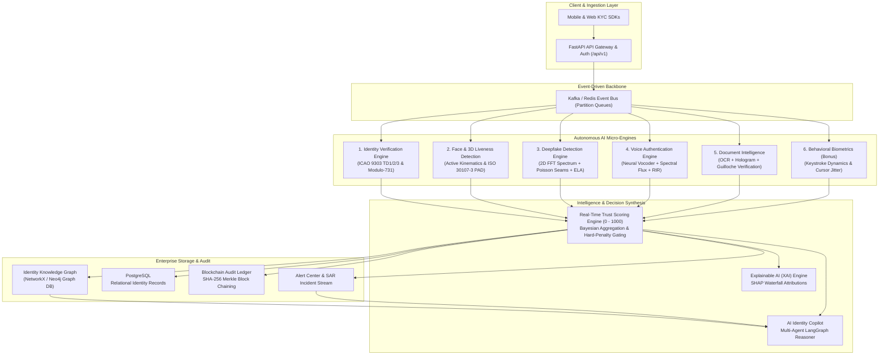

# Enterprise Digital Identity, Trust & Deepfake Detection Platform
### System Architecture Specification

---

## 1. High-Level Architecture Overview

The platform is an enterprise-scale, event-driven identity verification and fraud prevention system designed to process **600 Million annual identity verifications**, **15 Million Video KYC sessions**, and **8 Million daily voice calls** with sub-2 second SLA latency.

---

## 2. Core Engine Mathematical Formulations

### 2.1 ICAO Doc 9303 MRZ Checksum Algorithm (Modulo-731)
For any alphanumeric character sequence $S = c_1 c_2 \dots c_k$, each character is mapped to integer value $V(c_i)$ where `0-9` $\to 0-9$, `A-Z` $\to 10-35$, and `<` $\to 0$.

The check digit $C$ is computed using repeating weights $W = [7, 3, 1]$:
$$C = \left( \sum_{i=1}^{k} V(c_i) \cdot W_{(i-1) \pmod 3} \right) \pmod{10}$$

### 2.2 Deepfake 2D Fast Fourier Transform (FFT) Radial Analysis
To detect GAN upsampling and diffusion checkerboard artifacts, the 2D discrete Fourier transform of the facial image $f(x, y)$ is computed:
$$F(u, v) = \sum_{x=0}^{M-1} \sum_{y=0}^{N-1} f(x, y) e^{-j 2\pi \left(\frac{ux}{M} + \frac{vy}{N}\right)}$$
Azimuthal frequency integral variance in mid-to-high frequency bands $r \in [0.35 r_{\max}, 0.49 r_{\max}]$ exposes convolutional upsampling grid spikes typical of StyleGAN and Stable Diffusion.

### 2.3 Real-Time Multi-Signal Trust Score Synthesis
The continuous 0 to 1000 Trust Score is computed through multi-criteria Bayesian signal weighting with hard-penalty gate overrides:

$$T_{\text{base}} = w_{\text{id}} S_{\text{id}} + w_{\text{bio}} S_{\text{bio}} + w_{\text{df}} S_{\text{df}} + w_{\text{dev}} S_{\text{dev}} + w_{\text{graph}} S_{\text{graph}}$$

Where:
- $w_{\text{id}} = 0.25$ (Identity document integrity, MRZ checksum, age validity)
- $w_{\text{bio}} = 0.25$ (Face match cosine similarity, active blink/smile, 3D PAD liveness)
- $w_{\text{df}} = 0.20$ (Absence of 2D FFT spectral anomalies, face-swap seams, voice cloning)
- $w_{\text{dev}} = 0.15$ (Device fingerprint consistency, IP reputation, behavioral biometrics)
- $w_{\text{graph}} = 0.15$ (Absence of shared devices, puppet collision, or fraud syndicate links)

#### Hard Penalty Override:
$$\text{If } (P_{\text{deepfake}} \ge 0.50 \lor \text{Spoof} = \text{True} \lor \text{Tampered} = \text{True} \lor \text{Syndicate} = \text{True}) \implies T_{\text{final}} \le 380$$

---

## 3. Decision Tiers & Operational Gateways

| Trust Score Tier | Risk Level | Action | Protocol |
| :--- | :--- | :--- | :--- |
| **800 - 1000** | **LOW** | **APPROVED** | Automated straight-through KYC pass. Facial vector & device enrolled. |
| **650 - 799** | **MEDIUM** | **APPROVED** | Conditional pass with passive anomaly flag. |
| **450 - 649** | **HIGH** | **MANUAL REVIEW** | Escalated to Tier-2 Security Analyst with AI Copilot investigation dossier. |
| **0 - 449** | **CRITICAL** | **REJECTED** | Automated block. Device & IP blacklisted; automated FinCEN/AML SAR generated. |

---

## 4. Blockchain-Anchored Audit Proofs
Every verification transaction is assembled into an immutable audit block chained via SHA-256 Merkle trees:
$$\text{Block Hash} = \text{SHA256}(\text{Index} \parallel \text{Timestamp} \parallel \text{PrevHash} \parallel \text{MerkleRoot} \parallel \text{Nonce})$$
This guarantees complete mathematical proof against post-facto audit log tampering or compliance falsification.
